

# OpenVINO™ Test Drive

Get started with OpenVINO™ Test Drive, an application that allows you to run generative AI and vision models trained by [Intel® Geti™](https://docs.geti.intel.com/) directly on your computer or edge device using [OpenVINO™ Runtime](https://github.com/openvinotoolkit/openvino).

  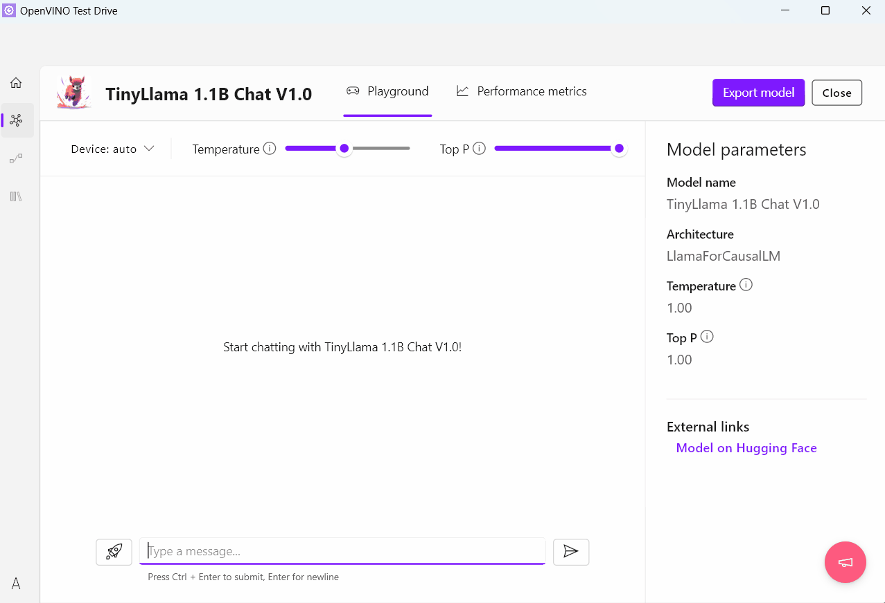

With use of OpenVINO™ Test Drive you can:

- **Chat with LLMs** and evaluating model performance on your computer or edge device
- **Experiment with different text prompts** to generate images using Stable Diffusion and Stable DiffusionXL models
- **Transcribe speech from video** using Whisper models, including generation of timestamps
- **Run and visualize results of models** trained by Intel® Geti™ using single image inference or batch inference mode

## Key features

📝 Text generation and LLM performance evaluation 

1. Choose a model from predefined set of popular models or pick one from Hugging Face using `Import model` -> `Hugging Face` and import it.

  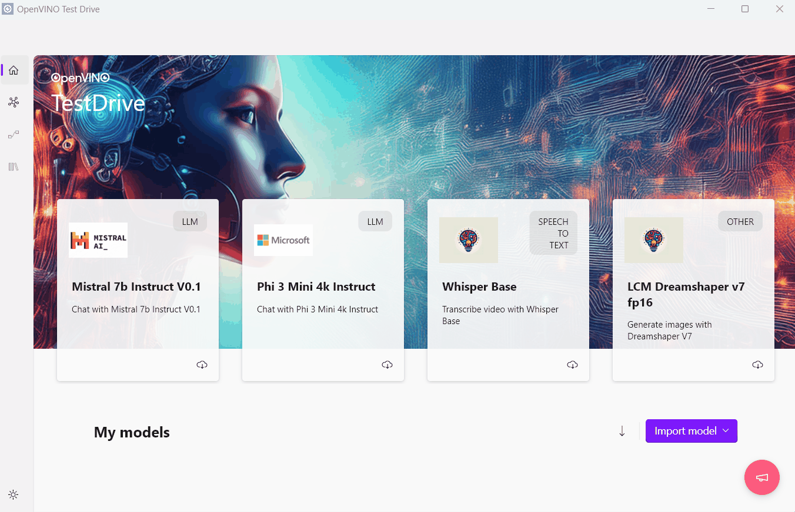

2. Pick imported LLM from `My models` section and chat with it using `Playground` tab. You can export LLM via `Export model` button.

  

3. Use `Performance metrics` tab to get LLM performance metrics on your computer.

  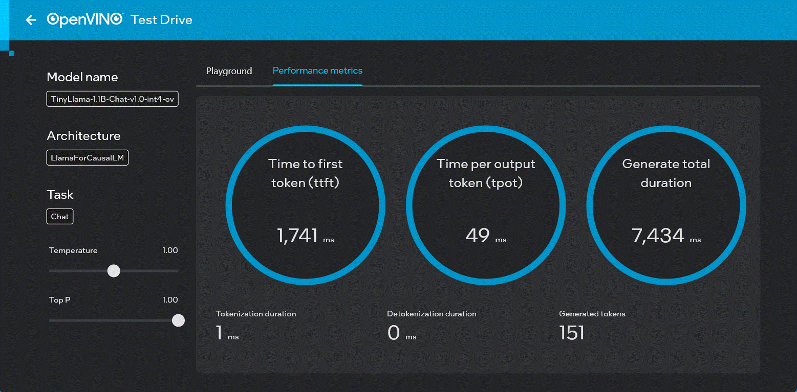

📚 Retrieval-Augmented Generation with LLM 

1. It is possible to upload files and create knowledge base for RAG (Retrieval-Augmented Generation) using `Knowledge base` tab

  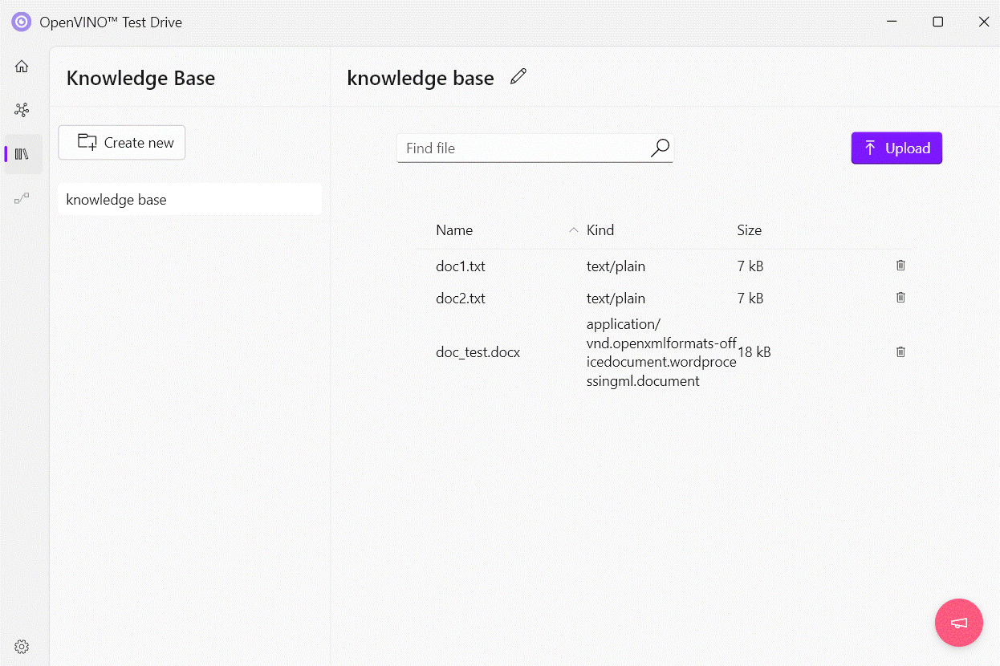

This knowledge base can be used during text generation with LLM models.

  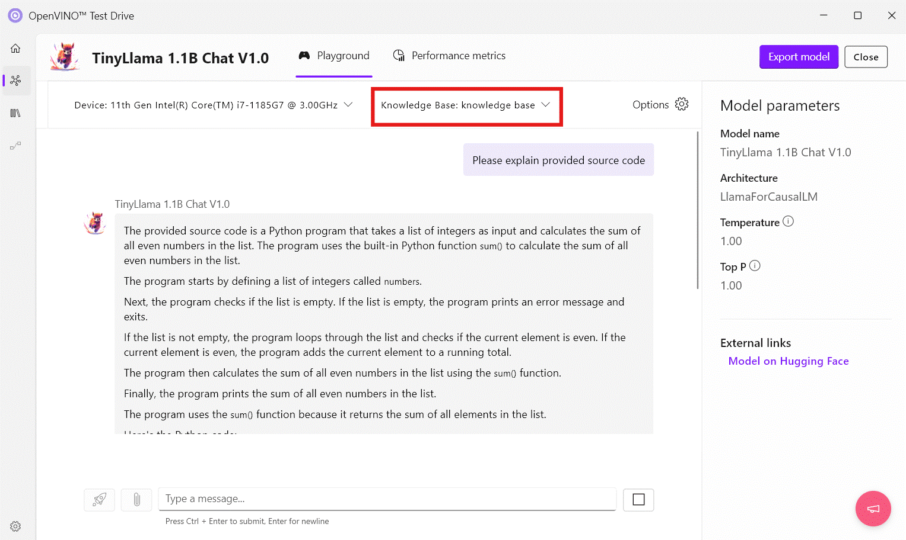

2. It is also possible to upload document directly using `Playground` tab.

  

🧠 Work with Visual Language Models 

1. Try Visual Language Model (VLM) for image analysis.

  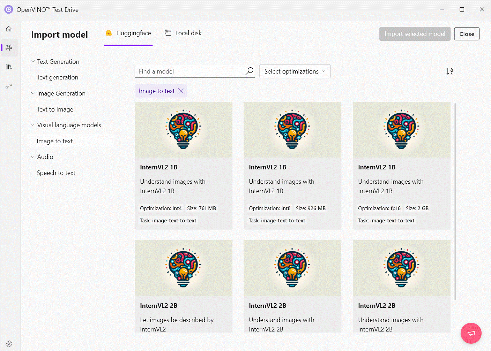

2. Pick imported VLM from `My models` section, upload image and analyze it.

  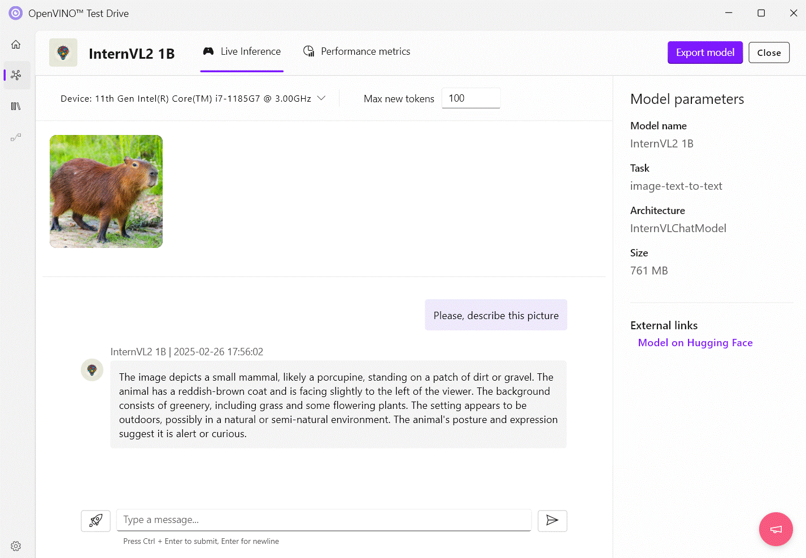

✍️ Transcribe speech from video 

1. Try Whisper for video transcription.

  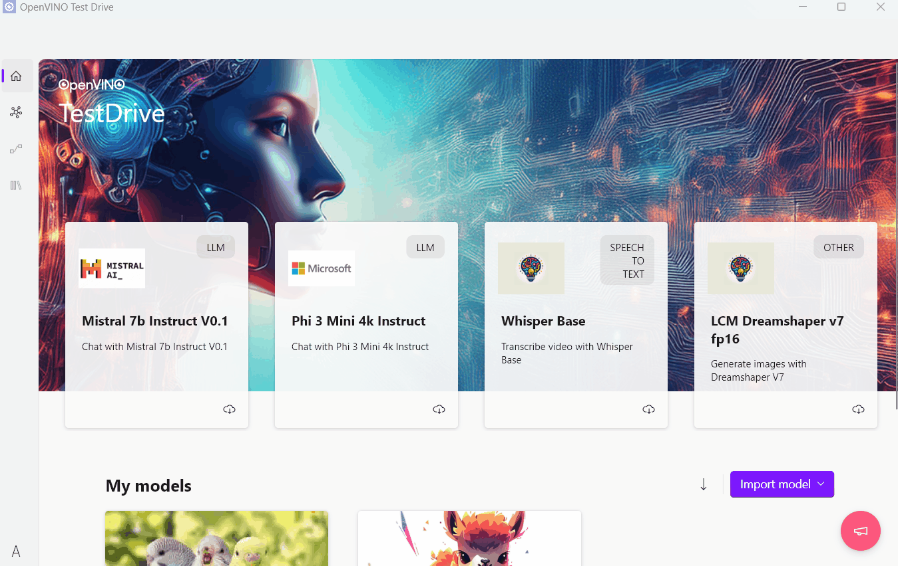

2. Pick imported speech-to-text LLM from `My models` section and upload video for transcription. It is also possible to search words in transcript or download it.

  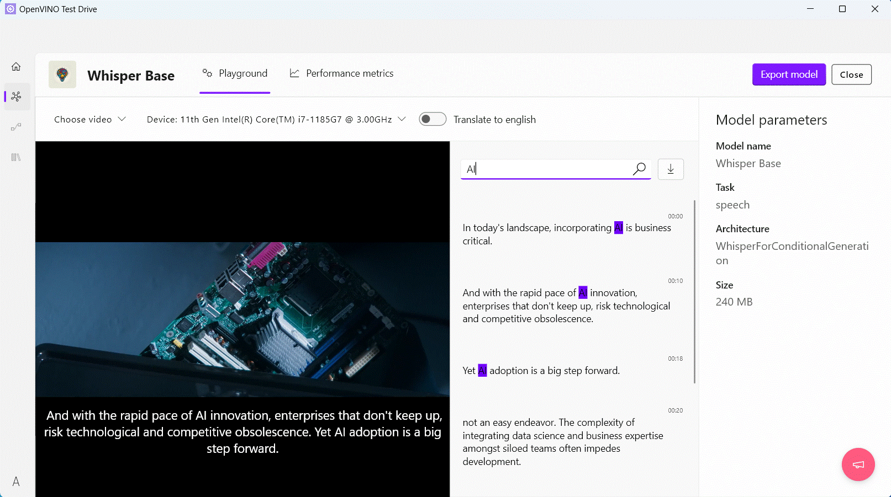

3. Use `Performance metrics` tab to get LLM performance metrics on your computer.

🎨 Image generation 

1. Choose an image generation LLM from predefined set of popular models or pick one from Hugging Face using `Import model` -> `Hugging Face` and import it.

2. Pick imported LLM from `My models` section and chat with it to generate image. It is also possible to download generated image.

  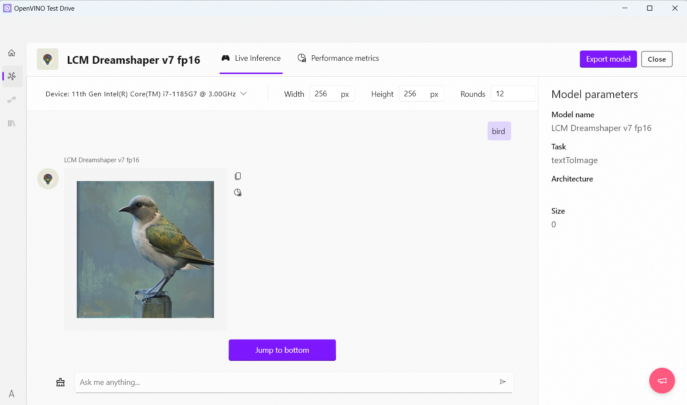

3. Use `Performance metrics` tab to get LLM performance metrics on your computer.

You can export LLM via `Export model` button.

🤖 Images inference with models trained by Intel® Geti™ 

1. Download code deployment for the model in OpenVINO format trained by Intel® Geti™.

  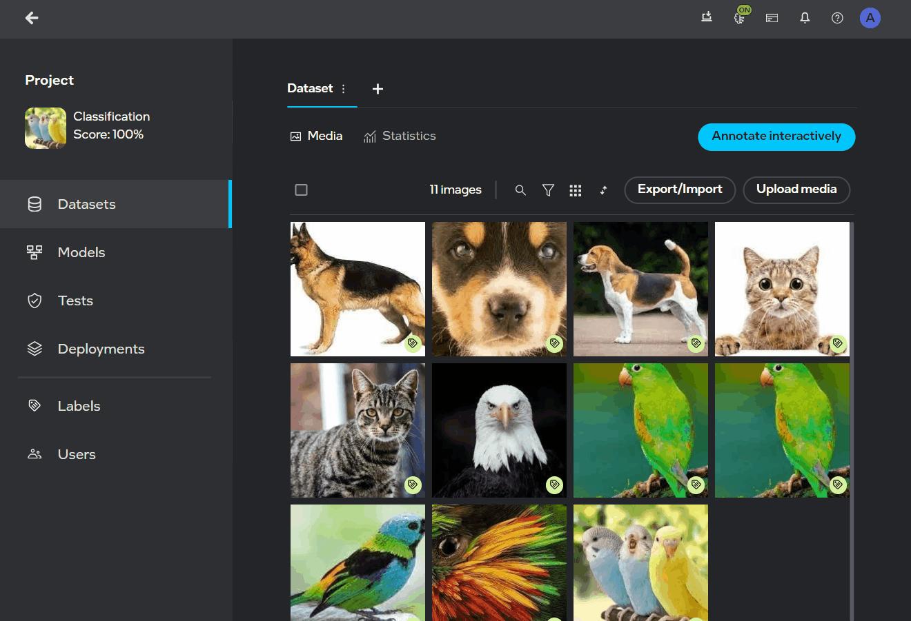

> [!NOTE]
> Please check [Intel® Geti™ documentation](https://docs.geti.intel.com) for more details.

2. Import deployment code into OpenVINO™ Test Drive using `Import model` -> `Local disk` button.

  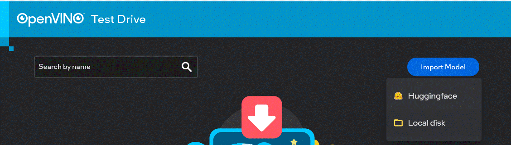

3. Run and visualize results of inference on individual images using `Live inference` tab.

  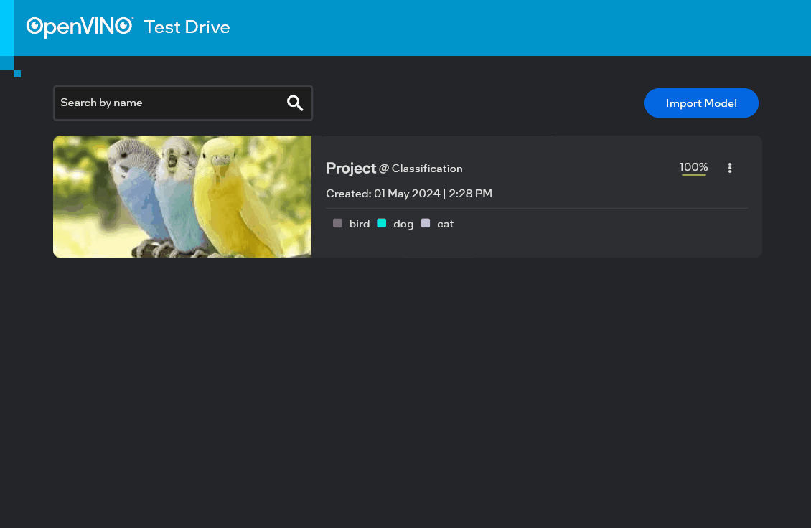

4. For batch inference, use `Batch inference` tab, provide paths to folder with input images in a `Source folder` and specify `Destination folder` for output batch inference results. Click on `Start` to start batch inference.

  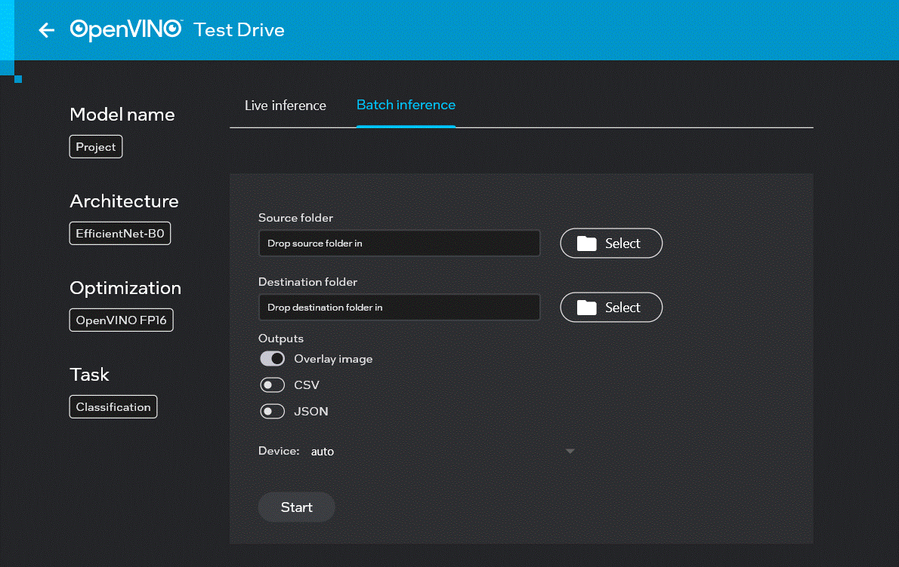

## Installation

Download the latest release from the [Releases repository](https://storage.openvinotoolkit.org/repositories/openvino_testdrive/).

> [!NOTE]
> To verify downloaded file integrity, you can generate a SHA-256 of the downloaded file and compare it to the SHA-256 from corresponding `.sha256` file published in Releases repository.

### Installation on Windows

> [!IMPORTANT]
> For Intel® NPU, please use the Intel® NPU Driver latest available version.

1. Downloading the zip archive [Releases repository](https://storage.openvinotoolkit.org/repositories/openvino_testdrive/) `Windows` folder .

  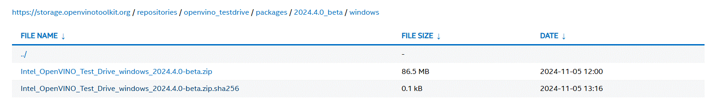

2. Extract zip archive double-click the MSIX installation package, click `Install` button and it will display the installation process

3. Click on the application name on Windows app list to launch OpenVINO™ Test Drive.

## Build

The application requires the flutter SDK and the dependencies for your specific platform to be installed.
Secondly, the bindings and its dependencies for your platform to be added to `./bindings`.

1. [Install flutter sdk](https://docs.flutter.dev/get-started/install). Make sure to follow the guide for flutter dependencies.
2. Build the bindings and put them to `./bindings` folder. OpenVINO™ Test Drive uses bindings to OpenVINO™ GenAI and OpenVINO™ Vision ModelAPI located in `./openvino_bindings` folder. See [readme](./openvino_bindings/README.md) for more details.
3. Once done you can start the application: `flutter run`

## Ecosystem

- [OpenVINO™](https://github.com/openvinotoolkit/openvino) - software toolkit for optimizing and deploying deep learning models.
- [GenAI Repository](https://github.com/openvinotoolkit/openvino.genai) and [OpenVINO Tokenizers](https://github.com/openvinotoolkit/openvino_tokenizers) - resources and tools for developing and optimizing Generative AI applications.
- [Intel® Geti™](https://docs.geti.intel.com/) - software for building computer vision models.
- [OpenVINO™ Vision ModelAPI](https://github.com/openvinotoolkit/model_api) - a set of wrapper classes for particular tasks and model architectures, simplifying data preprocess and postprocess as well as routine procedures.

## Contributing

For those who would like to contribute to the OpenVINO™ Test Drive, please check out [Contribution Guidelines](CONTRIBUTING.md) for more details.

## License

OpenVINO™ Test Drive repository is licensed under [Apache License Version 2.0](LICENSE).
By contributing to the project, you agree to the license and copyright terms therein and release your contribution under these terms.

FFmpeg is an open source project licensed under LGPL and GPL. See https://www.ffmpeg.org/legal.html. You are solely responsible for determining if your use of FFmpeg requires any additional licenses. Intel is not responsible for obtaining any such licenses, nor liable for any licensing fees due, in connection with your use of FFmpeg.
