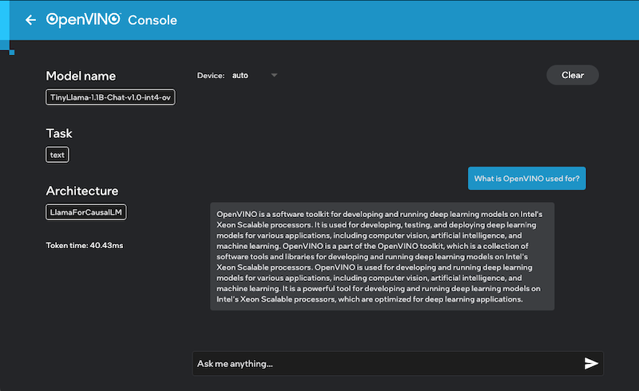

# OpenVINO™ Test Drive

Welcome to Intel OpenVINO Test Drive. This application allows you to run LLMs and Geti trained models directly on your computer using OpenVINO.

* LLM Inference
* Image inference:
    * Output CSV, JSON and/or Overlay image 
    * Run a batch inference task on a folder
    * Open camera and run inference (WIP)

# Using the Test Drive

When the application is started you can import a model using either Huggingface for LLMs or "from local disk" for geti models.

# Getting Started

## Release

Download and install a release from the Releases page.

## Build

The application requires the flutter SDK and the dependencies for your specific platform to be installed.
Secondly, the bindings and its dependencies for your platform to be added to `./bindings`.

1. [Install flutter sdk](https://docs.flutter.dev/get-started/install). Make sure to follow the guide for flutter dependencies.
2. [Download the bindings](https://github.com/intel-sandbox/applications.ai.geti.flutter.inference/releases) and extract them to ./bindings folder
3. Once done you can start the application: `flutter run`

## Build bindings

The console uses c bindings to OpenVINO. These are located in `./openvino` folder. See [readme.md](./openvino/README.md).

