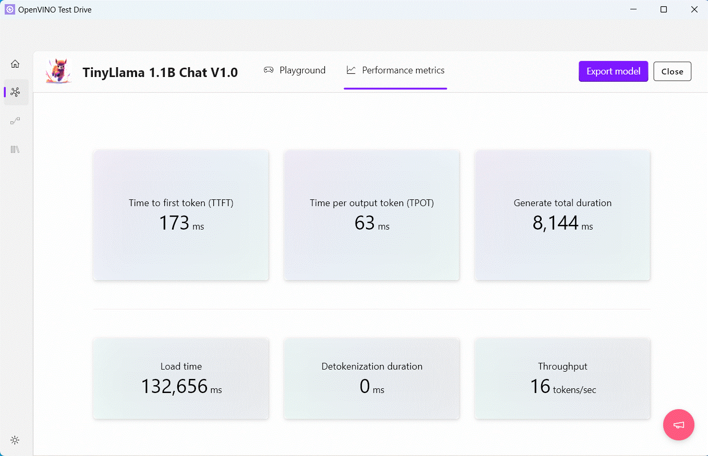
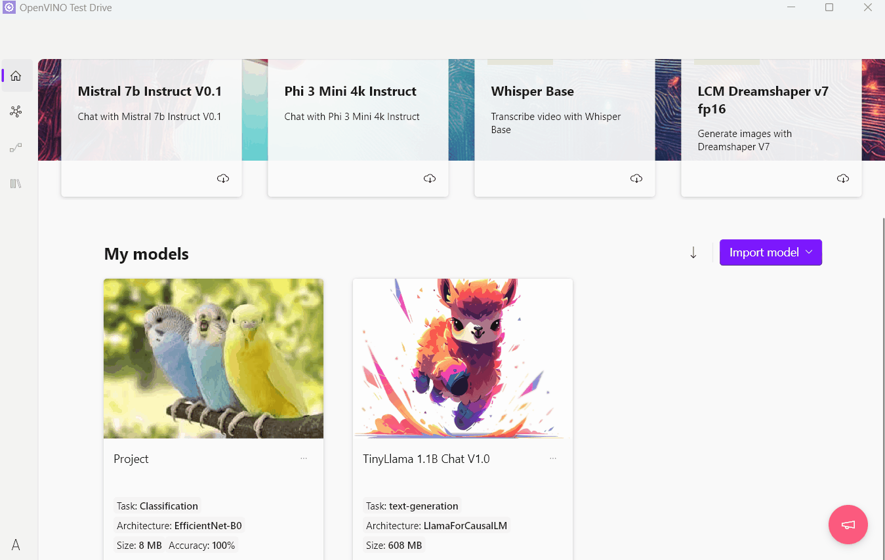
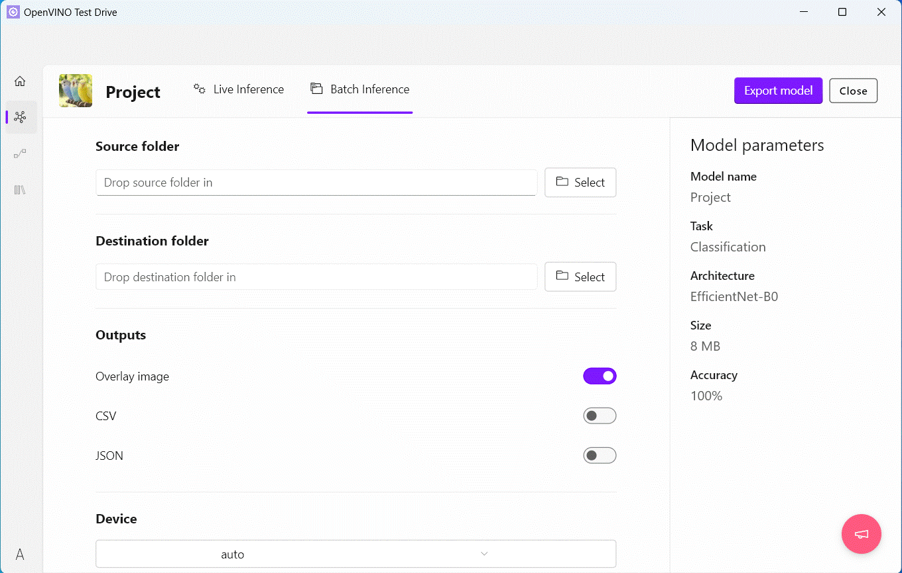

# OpenVINO™ Test Drive

Get started with OpenVINO™ Test Drive, an application that allows you to run generative AI and vision models trained by [Intel® Geti™](https://docs.geti.intel.com/) directly on your computer or edge device using [OpenVINO™ Runtime](https://github.com/openvinotoolkit/openvino).

  

With use of OpenVINO™ Test Drive you can:
+ **Chat with LLMs** and evaluating model performance on your computer or edge device
+ **Experiment with different text prompts** to generate images using Stable Diffusion and Stable DiffusionXL models (coming soon)
+ **Transcribe speech from video** using Whisper models, including generation of timestamps
+ **Run and visualize results of models** trained by Intel® Geti™ using single image inference or batch inference mode

## Installation

Download the latest release from the [Releases repository](https://storage.openvinotoolkit.org/repositories/openvino_testdrive/packages/).

> [!NOTE]
> To verify downloaded file integrity, you can generate a SHA-256 of the downloaded file and compare it to the SHA-256 from corresponding `.sha256` file published in Releases repository. 

Installation on Windows

1. Downloading the zip archive [Releases repository](https://storage.openvinotoolkit.org/repositories/openvino_testdrive/packages/) `Windows` folder .

  

2. Extract zip archive double-click the MSIX installation package, click `Install` button and it will display the installation process

  

3. Click on the application name on Windows app list to launch OpenVINO™ Test Drive.

## Quick start

Upon starting the application, you can import a model using either Hugging Face for LLMs or upload Intel® Geti™ models from local disk.

### Text generation and LLM performance evaluation

1. Choose a model from predefined set of popular models or pick one from Hugging Face using `Import model` -> `Hugging Face` and import it.

  

2. Pick imported LLM from `My models` section and chat with it using `Playground` tab.

  

3. Use `Performance metrics` tab to get LLM performance metrics on your computer or edge device

  

You can export LLM via `Export model` button.

### Transcribe speech from video

1. Choose a speech-to-text LLM from predefined set of popular models or pick one from Hugging Face using `Import model` -> `Hugging Face` and import it.

  

2. Pick imported speech-to-text LLM from `My models` section and upload video for transcription.

  

3. Use `Performance metrics` tab to get LLM performance metrics on your computer or edge device

  

You can export LLM via `Export model` button.

### Images inference with models trained by Intel® Geti™

1. Download code deployment for the model in OpenVINO format trained by Intel® Geti™. 

  

> [!NOTE]
> Please check [Intel® Geti™ documentation](https://docs.geti.intel.com) for more details.

2. Import deployment code into OpenVINO™ Test Drive using `Import model` -> `Local disk` button.

  

3. Run and visualize results of inference on individual images using `Live inference` tab.

  

4. For batch inference, use `Batch inference` tab, provide paths to folder with input images in a `Source folder` and specify `Destination folder` for output batch inference results. Click on `Start` to start batch inference.

  

You can share your ideas, thoughts and feedback using .

## Build

The application requires the flutter SDK and the dependencies for your specific platform to be installed.
Secondly, the bindings and its dependencies for your platform to be added to `./bindings`.

1. [Install flutter sdk](https://docs.flutter.dev/get-started/install). Make sure to follow the guide for flutter dependencies.
2. Build the bindings and put them to `./bindings` folder. OpenVINO™ Test Drive uses bindings to OpenVINO™ GenAI and OpenVINO™ Vision ModelAPI located in `./openvino_bindings` folder. See [readme](./openvino_bindings/README.md) for more details.
3. Once done you can start the application: `flutter run`

## Ecosystem

- [OpenVINO™](https://github.com/openvinotoolkit/openvino)  - software toolkit for optimizing and deploying deep learning models.
- [GenAI Repository](https://github.com/openvinotoolkit/openvino.genai) and [OpenVINO Tokenizers](https://github.com/openvinotoolkit/openvino_tokenizers) - resources and tools for developing and optimizing Generative AI applications.
- [Intel® Geti™](https://docs.geti.intel.com/) - software for building computer vision models.
- [OpenVINO™ Vision ModelAPI](https://github.com/openvinotoolkit/model_api) - a set of wrapper classes for particular tasks and model architectures, simplifying data preprocess and postprocess as well as routine procedures.

## Contributing

For those who would like to contribute to the OpenVINO™ Test Drive, please check out [Contribution Guidelines](CONTRIBUTING.md) for more details.

## License

OpenVINO™ Test Drive repository is licensed under [Apache License Version 2.0](LICENSE).
By contributing to the project, you agree to the license and copyright terms therein and release your contribution under these terms.
